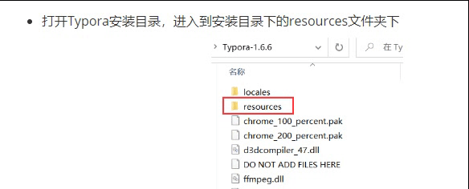
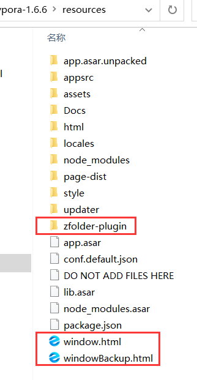

# Typora fold plugin

[简体中文](README.md) &nbsp;&nbsp;|&nbsp;&nbsp; [English](README-EN.md)

## Development Notes

- Typora versions：1.6.6
- Copyright: Just use it casually. If you're willing to mention the source code address, thank you so much.
- Development Notes:
  - I needed a similar feature while reading long documents using Typora, but the author didn't implement the relevant functions. And I couldn't find any relevant content online. So, I had no choice but to do it myself.
  - During the development, I had some future development ideas (which can be seen from the source code), but it's hard to say if they will be implemented.
  - If you have any questions or suggestions, please raise an issue.


**Important Note**:

The fold feature I implemented is not inserted into the native code directly, but rather added a JavaScript script in the HTML of the main interface of the electron framework.

Therefore, some code (the part with h headings, which has been commented out) doesn't work properly with the electron framework because I use the **method of inserting div containers**. There may be bugs and **potential data loss** when using it.If someone use these unsafe code, I'm not responsible for any data loss. It occurs only while editing, but no issues when not editing.

I hope that @AbnerLee, the creator of Typora, can either add a native fold functionality or introduce a plugin system.


## Features

- ul fold

  

  

  

- img fold

    

    


## How  to use

Install：

- Clone this repo 

- Open the installation directory of Typora and step into the "resources" folder within the installation directory.

  

  

- copy and backup

  - Backup the "window.html" file located in that directory.
  - Copy the downloaded "window.html" into the same folder.
  - Create a new folder within that directory named `zfolder-plugin`.
  - Copy `zfolder.js`, `zfolder.css`, and `down.svg` into the `zfolder-plugin` folder.

  > - "window.html" is the HTML file that represents the interface when Typora is launched.
  >
  > - I only added two pieces of content to this file, specifically on line 26 and line 1632.
  >
  >   ```html
  >    <link rel="stylesheet" href="./zfolder-plugin/zfolder.css" crossorigin="anonymous">
  >   ……
  >   <script src="./zfolder-plugin/zfolder.js" defer></script>
  >   ```
  
  

  

- Restart Typora to use


Functionality and usage:

- [x] fold/expand ul lists:
  - Move your mouse over the square of a collapsible to-do item or the dot next to a list item. Click on the arrow that appears to collapse or expand it.
  - This feature is safe to use as it doesn't involve inserting new divs, therefore there is no risk of data loss. I have personally used it extensively and never encountered any data loss issues.
- [x] ~~Collapse/expand h headings (Bug present):~~
  - Click on the arrow to the left of a heading to collapse it based on its level.
  - **Warning!** While I have roughly implemented this feature in the source code, using it may result in data loss due to compatibility issues with the electron framework.
- [x] img fold
- [ ] Code block collapse/expand:
  - This feature will be implemented when time allows.
  - It seems that the author already has a development plan related to folding. Perhaps there will be an official folding feature in the upcoming versions.


