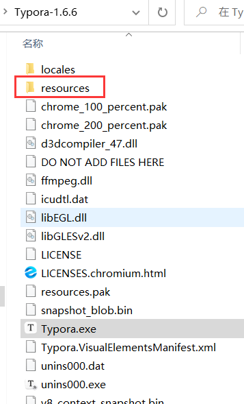

# Typora折叠小插件

[简体中文](README.md) &nbsp;&nbsp;|&nbsp;&nbsp; [English](README-EN.md)

## 开发说明

- Typora版本：1.8.10
- 版权（copyright）：就随手写的几百行小玩意随便用。愿意提一嘴源码地址就谢谢您嘞。
- 开发说明：
  - 我在用Typora阅读长文档时后实在需要类似功能，但是作者并没有实现相关功能。网上也没有找到相关内容。那没办法只能自己搞。
  - 开发的时候有后续的一些开发想法（从源码可以看出来），但后续不好说。
  - 有啥问题或指点欢迎提issue。


说明：

我写的折叠并非是原生代码中插入的，而是自己挂了个js脚本在electron框架的主界面的html里。在作者代码中钻空隙的同时还得和electron框架斗智斗勇难蚌  

期望Typora作者@AbnerLee大佬能加原生折叠功能或者增加插件系统。


## 效果演示

- ul折叠

  

  

  

  

- 图片折叠

  

    
  
    
  
    


## 功能与使用方式

安装：

- 下载本仓库内内容

- 打开Typora安装目录，进入到安装目录下的resources文件夹下

  

  

  

- 复制并备份

  - 备份该目录下的window.html文件
  - 将下载的window.html复制进该文件夹
  - 在该文件夹下创建一个新文件夹，命名为`zfolder-plugin`
  - 将`zfolder.js`、`zfolder.css`、`down.svg`复制进`zfolder-plugin`文件夹

  > - window.html就是Typora打开后界面的html
  >
  > - 实际上我只在该文件中的第26行和1632行添加了以下两个内容，将我自己编写的内容挂到页面解析里面去了
  >
  >   ```html
  >   <link rel="stylesheet" href="./zfolder-plugin/zfolder.css" crossorigin="anonymous">
  >   ……
  >   <script src="./zfolder-plugin/zfolder.js" defer></script>
  >   ```

  

  

  

- 重新启动Typora，即可使用


功能与使用方式：

- [x] li列表折叠
  - 鼠标移动到可以折叠的待办事项的方块或列表的圆点旁，点击显示出来的箭头即可折叠
  - 这个功能没问题的，因为**没有插入新div不会有数据丢失风险**。经过我的长期使用确实没发生过数据丢失问题。
- [x] ~~h标题折叠~~（有bug）

  - ~~点击标题左边的箭头按标题等级折叠~~

  - **警告!**我在源码里大致实现了功能，但是因为实现方式与electron框架不对付会出现丢失数据情况。但是不用这代码就没啥事，我都用8个月了
- [x] 图片折叠
- [ ] ~~代码块折叠~~
  - 有时间再整
  - 貌似作者已经有了折叠相关的开发计划，说不定在接下来的版本中就会有官方的折叠功能了


